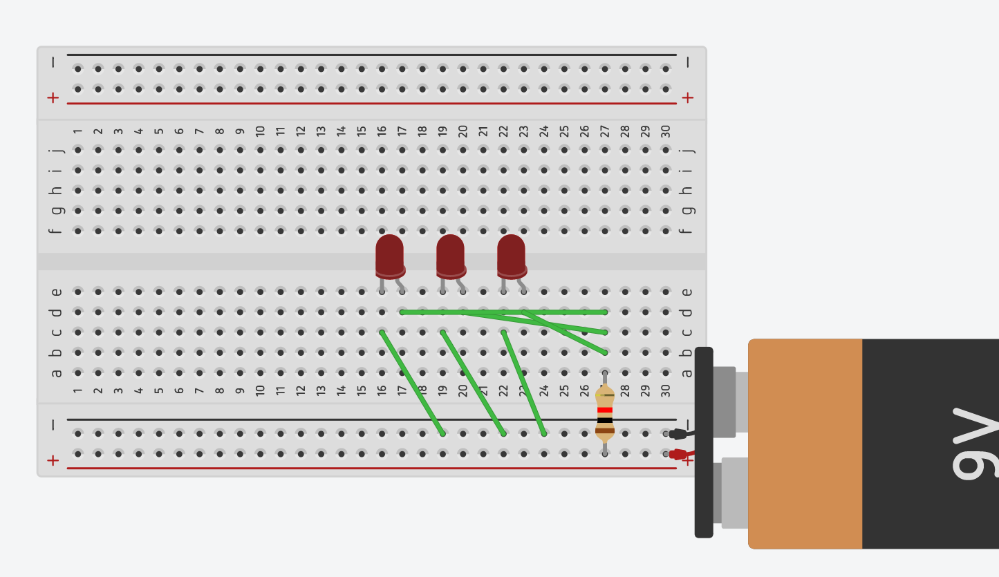

# Tinkercad
This week we created a few circuits in Tinkercad to explore the basics of circuits. We learned about 3 varieties of circuits, series, parallel, and analog. Series circuits require all resistors to be arrange such that the current only can take one path. Parallel circuits are different, arranging resistors such that instead of taking one path, it can take many simultaneously, and if one resistor is removed or damage, the others will continue to function as normal. Analog circuits are circuits which include signals that can be changed variably in a continuious, rather than binary (digital) fashion. Analog circuits can be either in series or parallel.

This is a basic series circuit. As you can see, the LEDs are arranged on the breadboard such that current can only flow in one path through them.

[Tinkercad link](https://www.tinkercad.com/things/iTgSzZUdWof-terrific-tumelo/editel?tenant=circuits)

This is a basic parallel circuit. The current has multiple paths to flow through, so if one LED burnt out, the others would continue to provide light.

[Tinkercad link](https://www.tinkercad.com/things/clRP9Yy7Rd2-stunning-bombul/editel)

# Building Circuits
After building these in Tinkercad, we created one of them with a breadboard hands on!

(image here)

